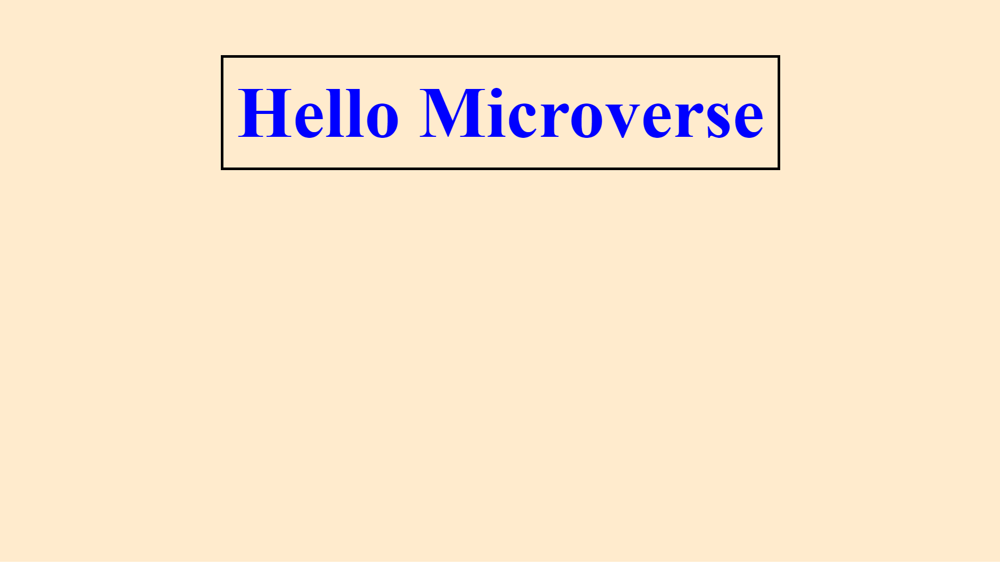

# Hello microverse

Single proyect to develop skills using linters with plane css and html

Plane css to do the style and not dynamic funtions.

## Built With

-CSS and HTML

## Getting Started

This is an example of how to use css and html to build a web page. Do not open pull request because this is merely educative.

## Authors

👤 **Luis pomare**

- GitHub: [@luis-pomare](https://github.com/luis-pomare)
- Twitter: [@LuisPomare1](https://twitter.com/LuisPomare1)
- LinkedIn: [luis-pomare-388116225](https://www.linkedin.com/in/luis-pomare-388116225/)

Give a ⭐️ if you like this project!
## 📝 License

This project is [MIT](./MIT.md) licensed.
